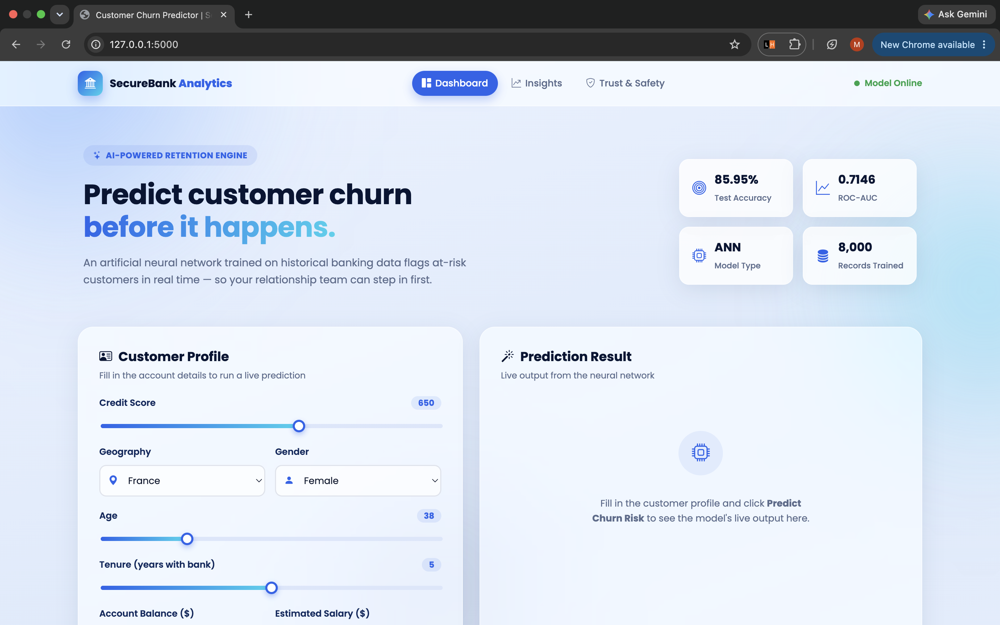
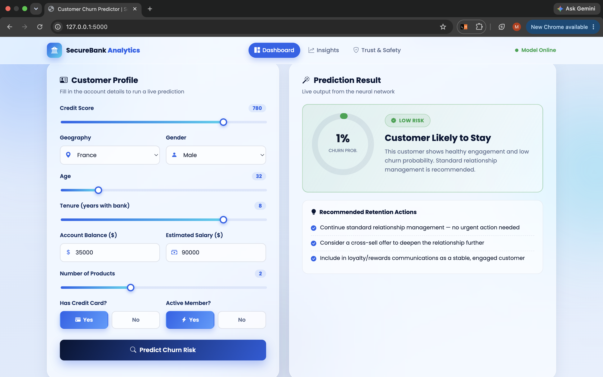
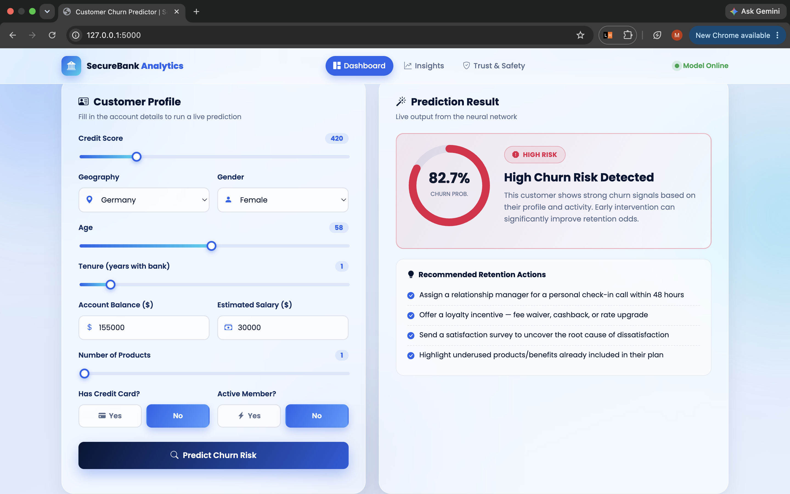

# Customer Churn Prediction using Artificial Neural Network (ANN)

# Project Overview
This project predicts whether a bank customer is likely to leave the bank (Churn) or stay based on customer information.

The model is built using an Artificial Neural Network (ANN) and deployed using Flask with an interactive HTML, CSS, and JavaScript frontend.


# Features

- Predict customer churn instantly
- Modern responsive web interface
- ANN-based prediction model
- Probability score for churn
- Interactive customer input form
- Flask backend integration


# Technologies Used

- SQL
- Python
- TensorFlow / Keras
- Flask
- HTML
- CSS
- JavaScript
- Pandas
- NumPy
- Scikit-learn
- Joblib


# Dataset Features

The model uses the following customer information:

- Credit Score
- Geography
- Gender
- Age
- Tenure
- Account Balance
- Number of Products
- Has Credit Card
- Active Member
- Estimated Salary

Target Variable:

- Exited (Customer Churn)


# Machine Learning Model

- Model: Artificial Neural Network (ANN)
- Optimizer: Adam
- Loss Function: Binary Crossentropy
- Evaluation Metric: Accuracy


# Model Performance

- Accuracy: 85.95%
- ROC-AUC Score: 0.7146


# Project Structure


Customer_Churn_Prediction
│
├── app/
│   ├── app.py
│   ├── customer_churn.model.keras
│   ├── scaler.pkl
│   ├── templates/
│   │      index.html
│   └── static/
│          ├── css/
│          │      style.css
│          └── js/
│                 script.js
│
├── data/
│      cc_churn_cleaned.csv
│
├── notebook/
│      customer_churn.ipynb
│
├── sql/
│      CC_Churn_script.sql
│
└── README.md


#  Run the Project

Clone the repository

```bash
git clone <repository-link>
```

Install dependencies

```bash
pip install -r requirements.txt
```

Run Flask

```bash
python app.py
```

Open

```
http://127.0.0.1:5000
```


# Project Screenshots

# Dashboard



---

# Low Churn Risk Prediction



---

# High Churn Risk Prediction



---

#  Developed By

Muskan Mathur, B.Tech (Artificial Intelligence & Machine Learning)

If you like this project, don't forget to give it a star.

Thankyou🫶🏼